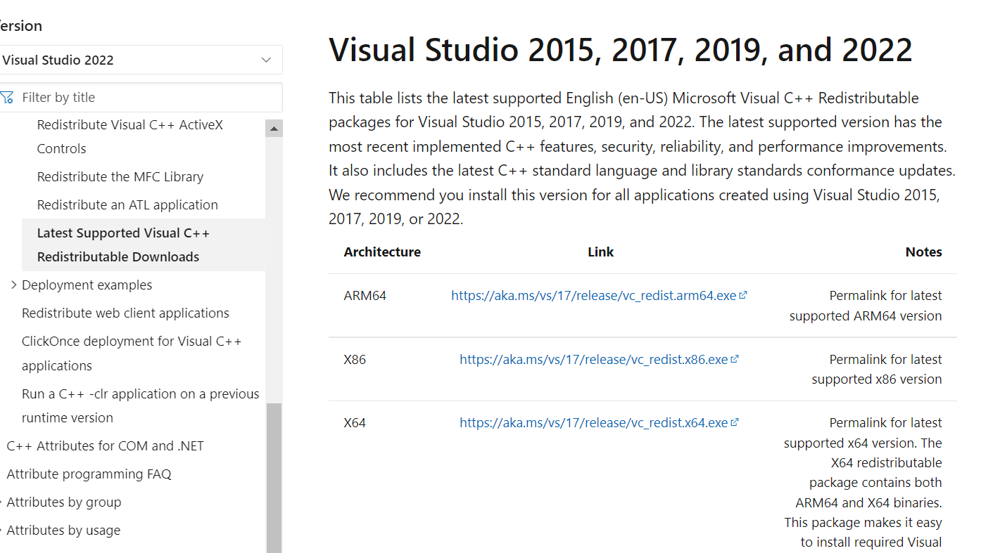
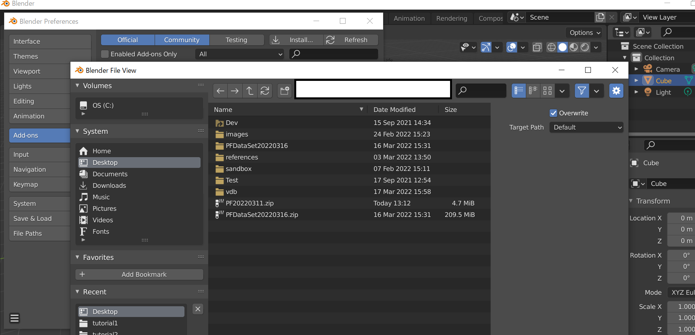
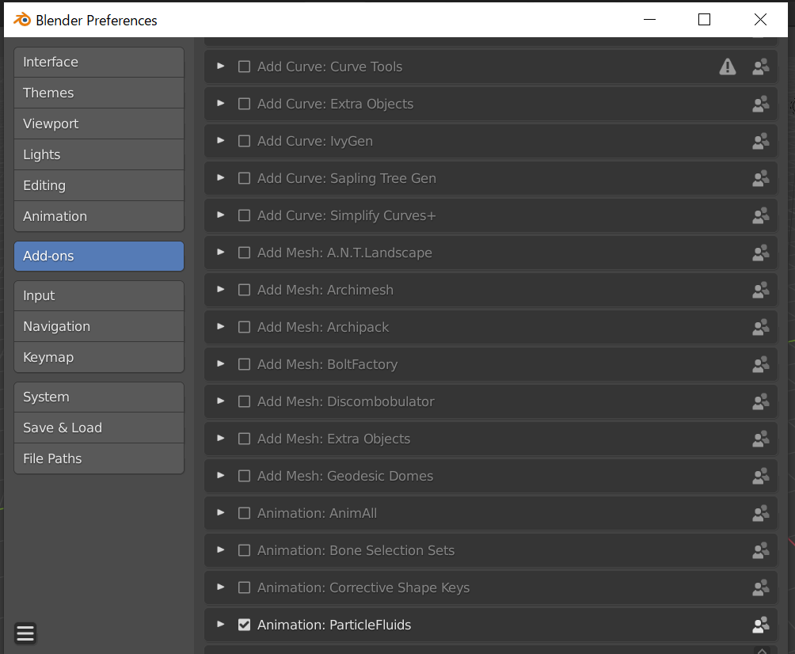

# How to Install ParticleFluids Add-On

2022/03/31 

## Install Runtime(Must, but only one time)
First of all, please download Visual Studio2019 runtime(x64) from Microsoft's web page and run it.

[VisualC++runtime](https://docs.microsoft.com/ja-jp/cpp/windows/latest-supported-vc-redist?view=msvc-170
 "VisualC++runtime")

 

## Install Add-On
- Start your Blender.
- [Edit]->[Preferences]->[Install], and select our add-on(PFXXX.zip), and [Install Add-on]．
 

- Check [Community]->[Animation: ParticleFluids]．
 
