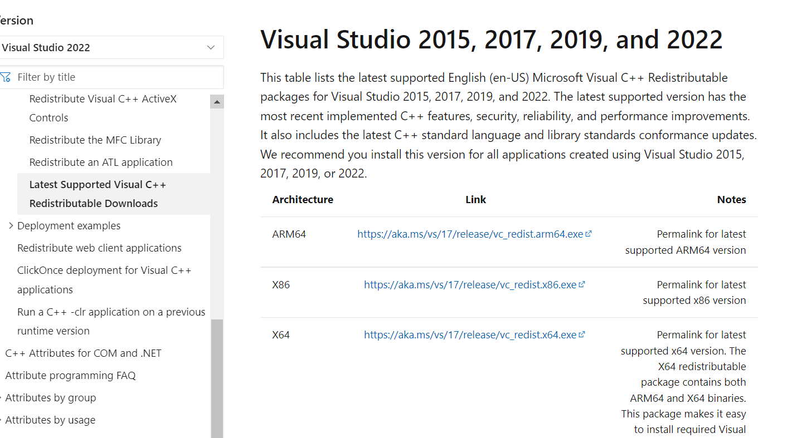
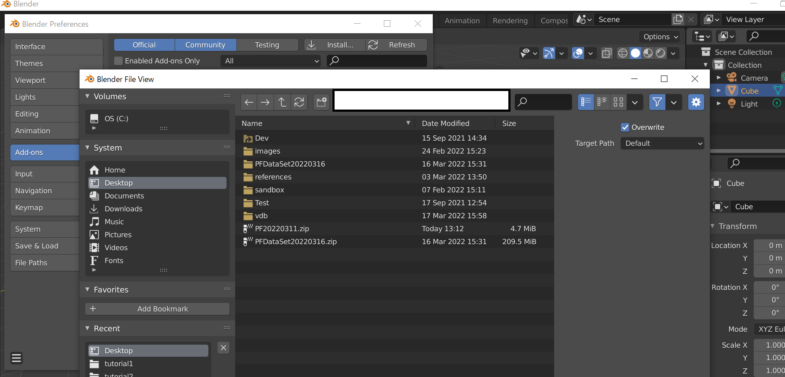

# How to Install ParticleFluids Add-On

2022/03/31 

## ランタイムのインストール（初回のみ必須）
Microsoft社のWebサイトからVisualStudio2019ランタイム(x64)をダウンロードします．

[VisualC++RuntimeLink](https://docs.microsoft.com/ja-jp/cpp/windows/latest-supported-vc-redist?view=msvc-170
 "VisualC++runtime")

下にあるX64を選択します．
 

それを実行してインストールします．

## アドオンのインストール
- Blenderを起動します．
- [Edit]->[Preferences]->[Install]でPFXXX.zipを選択して[Install Add-on]を押します．
 

- [Community]->[Animation: ParticleFluids]のチェックを入れます．
 
